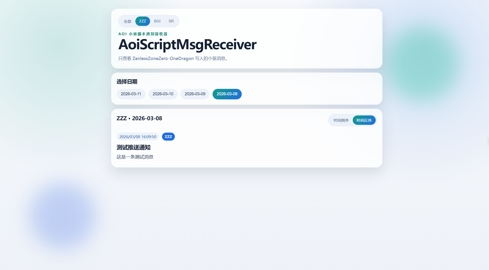

# AoiScriptMsgReceiver

`AoiScriptMsgReceiver` 是一个 Aoi 小葵脚本接收器，用于接收并展示最近 7 天内的脚本消息。

支持的脚本包括：
- `ZenlessZoneZero-OneDragon`
- `better-genshin-impact`
- `March7th Assistant`

## 项目截图


## 环境要求

- Python 3.11+

## 安装与启动

### PowerShell

```powershell
python -m venv .venv
.\.venv\Scripts\Activate.ps1
pip install -r requirements.txt
uvicorn main:app --reload
```

### CMD

```cmd
python -m venv .venv
.\.venv\Scripts\activate.bat
pip install -r requirements.txt
uvicorn main:app --reload
```

启动后访问：

- 看板页面：`http://127.0.0.1:8000/`
- Swagger 文档：`http://127.0.0.1:8000/docs`

## Docker Compose

在项目根目录执行：

```powershell
docker compose up -d --build
```

查看日志：

```powershell
docker compose logs -f
```

停止容器：

```powershell
docker compose down
```

## 项目结构

```text
AoiScriptMsgReceiver/
├── main.py
├── requirements.txt
├── docker-compose.yml
├── Dockerfile
├── routes/
│   ├── __init__.py
│   ├── bgi.py
│   ├── sr.py
│   └── zzz.py
├── utils/
│   ├── __init__.py
│   ├── bgi_utils.py
│   ├── sr_utils.py
│   ├── system_utils.py
│   └── zzz_utils.py
├── static/
│   ├── index.html
│   └── style.css
├── image_cache/
└── data.db
```
